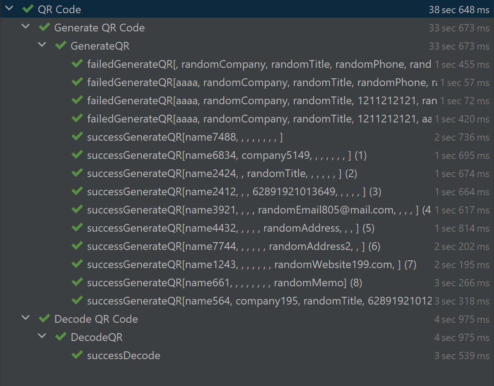

# Installation

1. Install and add to path [JAVA 11](https://www.oracle.com/id/java/technologies/javase/jdk11-archive-downloads.html)
2. Add systems variable JAVA_HOME with path JAVA
3. Verify the installed Java with `java --version`
2. Install and add to path [Maven](https://maven.apache.org/download.cgi)
3. Add systems variable MAVEN with path Maven
4. Verify the installed Maven with `mvn --version`
5. Install [Intellij Idea Community version](https://www.jetbrains.com/idea/download/#section=windows)
5. Clone or open this repository in Intellij
6. Open pom.xml
7. [Reload Maven project](https://www.jetbrains.com/help/idea/delegate-build-and-run-actions-to-maven.html#maven_reimport)
8. Right-click file `qrCode.xml` in src/test/java/runner file
9. Choose Run above the Debug options
10. The test will run automatically

# Result

Disclaimer:
- it's only the Contact information option in Contents dropdown, since the other options has different flow
- it's using POM pattern and DDT mechanism

## Generate QR page

For negative case with 4 cases: ALL PASSED

For positive case with 10 cases: ALL PASSED

The validation include the value of URL generated for QR image

## Decode QR Code

PASSED for positive case with flow start from uploading the data in generate QR code page

